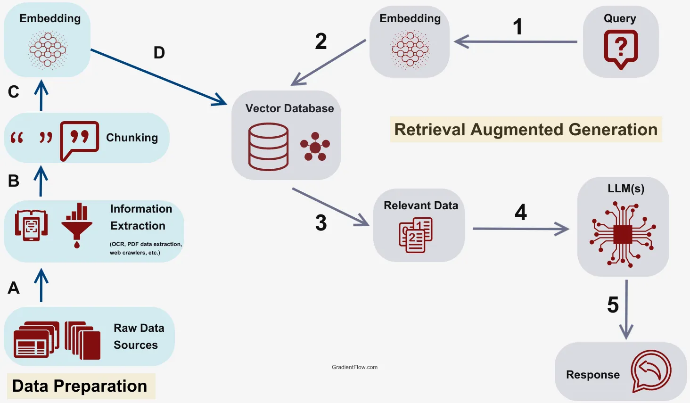

# PaperLM - AI-Powered Document Analysis Platform


A sophisticated Retrieval Augmented Generation (RAG) application that transforms how you interact with documents. Built with Next.js 15 and modern AI technologies, PaperLM offers advanced document analysis, intelligent chat capabilities, and comprehensive note-taking features inspired by Google NotebookLM.

## 🎥 Demo

📺 **[Watch Full Demo on YouTube](https://youtu.be/BzCKh6OFFFo)** - See PaperLM in action with document upload, AI chat, and smart notebook features

## ✨ Key Features

### 🎯 Advanced Document Processing

- **Multi-Format Support**: Upload PDFs, TXT files, CSV documents, DOCX files, paste text content, or import from YouTube videos and websites
- **Intelligent Text Processing**: Advanced chunking algorithms with LangChain for optimal content segmentation
- **Vector Embeddings**: Semantic understanding through OpenAI text embeddings and Qdrant vector database
- **Real-Time Processing**: Live status updates with beautiful animated progress indicators
- **Content Validation**: Automatic file type detection and content validation

### 🤖 Intelligent AI Chat System

- **Real-Time Streaming**: Powered by Vercel AI SDK for instant response streaming with typing indicators
- **Context-Aware Conversations**: Ask questions about your documents with full context understanding
- **Stream Controls**: Toggle streaming mode, abort responses mid-stream, and control chat experience
- **Dynamic Loading States**: Beautiful, animated loading messages that adapt to your query type
- **Smart Citations**: Responses include source citations with relevance scores and quick access to original content
- **Dual-Mode Support**: Seamless fallback between streaming and non-streaming modes for reliability
- **Usage Management**: Built-in rate limiting with 10 free queries per session for unauthenticated users
- **Citation-to-Notebook**: One-click addition of citations to your notebook for future reference

### 📝 Smart Notebook System

- **Automatic Note Generation**: AI automatically creates analysis cards when documents are processed
- **Animated Processing**: Beautiful gradient animations show real-time document analysis progress
- **Multiple Note Types**: Support for summaries, insights, quotes, and custom notes
- **AI Insights Generation**: Generate comprehensive insights across multiple documents
- **Audio Overview**: Create audio summaries of your document collection (demo implementation)

### 🎨 Professional User Interface

- **Three-Panel Layout**: Clean, professional design inspired by Google NotebookLM
- **Collapsible Panels**: Space-efficient design with smooth animations and hover effects
- **Compact Document Cards**: Professional cards with gradient animations during processing
- **Responsive Design**: Seamless experience across desktop, tablet, and mobile devices
- **Dark Mode Ready**: Built with modern CSS variables for easy theme switching
- **Interactive Guided Tour**: Beautiful onboarding experience with custom animations and contextual tips

### 🔐 Authentication & Data Management

- **Clerk Authentication**: Secure user authentication with social login options
- **Session Persistence**: Robust data persistence that survives browser refreshes
- **Local Storage Fallback**: Seamless experience for both authenticated and guest users
- **Cross-Device Sync**: Automatic synchronization across multiple devices for authenticated users
- **Data Security**: All sensitive data encrypted and stored securely

## 🛠️ Technology Stack

### Frontend Technologies

- **Framework**: Next.js 15 with App Router and React 19
- **Language**: TypeScript for enhanced development experience
- **Styling**: Tailwind CSS with custom design system
- **Animations**: Framer Motion for professional animations and micro-interactions
- **Icons**: Lucide React for consistent iconography
- **UI Components**: Custom component library with accessibility features
- **Guided Tours**: @reactour/tour with custom animated components for user onboarding

### Backend Infrastructure

- **Runtime**: Node.js with modern ES modules
- **Database**: MongoDB for document and user data storage
- **Authentication**: Clerk for secure user management and social authentication
- **Session Management**: Enhanced local storage with automatic data persistence
- **Vector Database**: Qdrant for semantic search (with intelligent fallback to local storage)
- **File Storage**: Cloudinary integration for scalable file management

### AI & Machine Learning

- **AI Framework**: Vercel AI SDK for streaming and standardized AI provider patterns
- **Large Language Model**: OpenAI GPT-4 for intelligent document analysis
- **Real-Time Streaming**: Built-in streaming support with typing indicators and user controls
- **Embeddings**: OpenAI text-embedding models for semantic understanding
- **Document Processing**: LangChain for intelligent text chunking and processing
- **RAG Pipeline**: Custom implementation with advanced vector similarity search
- **Context Management**: Sophisticated prompt engineering for accurate responses

### Development & Deployment

- **Package Manager**: npm with modern dependency management
- **Build System**: Next.js optimized build pipeline
- **Environment**: Environment-based configuration management
- **Code Quality**: ESLint and TypeScript for code consistency
- **Version Control**: Git with structured branching strategy

## 🌊 Vercel AI SDK Integration

PaperLM now features advanced streaming capabilities powered by the Vercel AI SDK, providing users with real-time AI responses and an enhanced interactive experience.

### ✨ Streaming Features

- **⚡ Real-Time Responses**: Instant streaming of AI responses with live typing indicators
- **🎮 User Controls**: Toggle streaming mode on/off, abort responses mid-stream
- **🔄 Fallback Support**: Automatic fallback to non-streaming mode for reliability
- **📊 Enhanced Citations**: Real-time citation extraction and display during streaming
- **🎯 Performance Optimized**: Reduced latency and improved user experience

### 🏗️ Architecture

- **Streaming APIs**: `/api/query/stream` and `/api/chat/stream` endpoints
- **Custom Hooks**: `useStreamingChat` for state management and stream control
- **React Components**: `StreamingMessage` for real-time UI updates
- **Error Boundaries**: Comprehensive error handling with graceful degradation

### 📚 Documentation

For detailed implementation information, see [VERCEL_AI_SDK_INTEGRATION.md](./VERCEL_AI_SDK_INTEGRATION.md) which includes:
- Complete architecture diagrams with custom SVG visualizations
- API endpoint documentation with request/response examples
- Component integration guides and usage patterns
- Troubleshooting guide and performance optimization tips

## 🚀 Installation & Setup

### System Requirements

- **Node.js** 18.0 or higher
- **npm** 9.0 or higher
- **OpenAI API Key** (required for AI functionality)
- **MongoDB** (local installation or MongoDB Atlas cloud service)
- **Clerk Account** (optional - for user authentication features)
- **Qdrant** (optional - for enhanced vector search, falls back to local storage)

### Step-by-Step Installation

1. **Clone the Repository**

   ```bash
   git clone https://github.com/yourusername/paperlm.git
   cd paperlm
   ```

2. **Install Dependencies**

   ```bash
   # Install all required packages
   npm install
   
   # Verify installation
   npm run build
   ```

3. **Environment Configuration**

   Create your environment configuration:

   ```bash
   # Copy the example environment file
   cp .env.example .env.local
   ```

   Configure your `.env.local` file with the following settings:

   ```env
   # ===== REQUIRED SETTINGS =====
   
   # OpenAI Configuration (Required)
   OPENAI_API_KEY=sk-your_openai_api_key_here
   
   # ===== OPTIONAL SETTINGS =====
   
   # Clerk Authentication (Optional - enables user accounts)
   NEXT_PUBLIC_CLERK_PUBLISHABLE_KEY=pk_test_your_clerk_publishable_key
   CLERK_SECRET_KEY=sk_test_your_clerk_secret_key
   NEXT_PUBLIC_CLERK_SIGN_IN_URL=/sign-in
   NEXT_PUBLIC_CLERK_SIGN_UP_URL=/sign-up
   
   # Vector Database (Optional - falls back to local storage)
   QDRANT_URL=http://localhost:6333
   QDRANT_API_KEY=your_qdrant_api_key_here
   
   # File Storage (Optional - for cloud file management)
   CLOUDINARY_CLOUD_NAME=your_cloudinary_cloud_name
   CLOUDINARY_API_KEY=your_cloudinary_api_key
   CLOUDINARY_API_SECRET=your_cloudinary_api_secret
   ```

4. **Database Setup (Optional)**

   For persistent data storage across sessions:

   **Option A: Local MongoDB**

   ```bash
   # Install MongoDB Community Edition
   # macOS with Homebrew:
   brew install mongodb-community
   
   # Start MongoDB service
   brew services start mongodb-community
   
   # Verify connection
   mongosh --eval "db.adminCommand('ismaster')"
   ```

   **Option B: MongoDB Atlas (Recommended for production)**
   1. Create account at [MongoDB Atlas](https://www.mongodb.com/atlas)
   2. Create a new cluster
   3. Get connection string and update `MONGODB_URI`
   4. Add your IP to whitelist

5. **Start the Development Server**

   ```bash
   # Start the development server
   npm run dev
   
   # Server will start on http://localhost:3000
   # Hot reloading is enabled for development
   ```

6. **Access the Application**
   - Open your browser and navigate to [http://localhost:3000](http://localhost:3000)
   - The application will load with the three-panel interface
   - You can start using the app immediately without authentication (guest mode)
   - For full features, create an account using the user menu in the top-right corner

### Verification Steps

After setup, verify everything works correctly:

1. **Test Document Upload**: Upload a PDF or text file in the Sources panel
2. **Test AI Chat**: Ask a question about your uploaded document
3. **Test Notebook**: Check that notebook cards are automatically generated
4. **Test Authentication**: Create an account to test user-specific features

## 📖 Comprehensive User Guide

### Getting Started

PaperLM features a clean three-panel interface designed for optimal document analysis workflow:

- **Left Panel**: Sources - Upload and manage your documents
- **Center Panel**: Notebook - AI-generated insights and your personal notes  
- **Right Panel**: Chat - Intelligent conversation with your documents

Both the left and right panels can be collapsed for focused work on the center panel.

#### 🎯 Interactive Guided Tour

New to PaperLM? Don't worry! We've included a beautiful, interactive guided tour that will walk you through all the key features:

- **Auto-Launch**: Automatically starts for first-time users after the app loads
- **Manual Access**: Click the "Tour" button in the header anytime to restart
- **Custom Animations**: Smooth, feather-like animations with custom easing curves
- **Contextual Tips**: Practical tips and suggestions for each panel
- **Progress Tracking**: Visual progress indicators and step-by-step navigation
- **Smart Positioning**: Tour steps automatically position themselves optimally

The tour covers:

1. **Welcome & Overview** - Introduction to PaperLM's capabilities
2. **Sources Panel** - How to upload documents and add content
3. **Smart Notebook** - Understanding AI-generated insights and note creation
4. **AI Chat** - Learning to interact with your documents
5. **Usage Tracking** - Understanding query limits and authentication benefits

### 1. 📁 Adding Content (Sources Panel)

#### Uploading Documents

- **Drag & Drop**: Simply drag files into the upload area
- **Browse Files**: Click to select PDFs, TXT, CSV, or DOCX files
- **File Validation**: Automatic type checking and size validation
- **Processing Status**: Real-time progress with animated indicators

#### Adding Text Content

- **Direct Paste**: Paste text content directly for immediate processing
- **Text Formatting**: Maintains basic formatting and structure
- **Quick Processing**: Faster than file uploads for text-only content

#### Importing from Web Sources

- **YouTube Videos**: Paste YouTube URLs to analyze video transcripts
- **Website Content**: Import content from web pages automatically
- **URL Validation**: Automatic checking of URL validity and accessibility

#### Content Management

- **Visual Cards**: Each document displays as a professional card with metadata
- **Processing Animation**: Beautiful gradient animations during document analysis
- **Status Indicators**: Clear status for ready, processing, or error states
- **Quick Actions**: Delete, view details, or access source URLs directly

### 2. 🤖 AI Chat Interaction (Chat Panel)

#### Starting Conversations

- **Context-Aware**: AI understands all your uploaded documents
- **Query Types**: Support for summaries, comparisons, analysis, and specific questions
- **Dynamic Loading**: Beautiful animated loading states that adapt to your query type
- **Usage Tracking**: Clear indicators of remaining free queries (10 per session for guests)

#### Advanced Features

- **Smart Citations**: Every response includes source citations with relevance scores
- **Citation Actions**: Copy citations or add them directly to your notebook
- **Conversation History**: Full chat history maintained throughout your session
- **Error Handling**: Graceful handling of API errors with user-friendly messages

#### Query Examples

- "Summarize the main points from all documents"
- "What are the key differences between document A and B?"
- "Find quotes about [specific topic]"
- "Create a timeline from the video transcript"

### 3. 📝 Smart Notebook Management (Notebook Panel)

#### Automatic Note Generation

- **AI Analysis Cards**: Automatically generated when documents are processed
- **Processing Animation**: Watch as AI analyzes your documents with gradient animations
- **Content-Aware**: Different analysis based on document type (PDF, YouTube, Website)
- **Instant Availability**: Notes appear as soon as document processing completes

#### Manual Note Creation

- **Multiple Types**: Create summaries, insights, quotes, or custom notes
- **Rich Content**: Support for markdown formatting and structured content
- **Metadata**: Automatic timestamps and source tracking
- **Organization**: Visual cards with type indicators and tags

#### Advanced Notebook Features

- **Generate Insights**: AI-powered analysis across multiple documents
- **Audio Overview**: Create audio summaries of your document collection
- **Citation Integration**: Seamlessly add chat citations to your notebook
- **Search & Filter**: Quickly find specific notes or content types

### 4. 🔐 User Authentication & Data Management

#### Guest Mode

- **Immediate Access**: Start using the app without any registration
- **Session Storage**: Data persists during your browser session
- **Limited Features**: 10 free AI queries per session
- **No Sync**: Data stays local to your device

#### Authenticated Users

- **Full Access**: Unlimited AI queries and advanced features
- **Cross-Device Sync**: Access your documents and notes from anywhere
- **Persistent Storage**: Data saved securely in the cloud
- **Enhanced Features**: Additional AI capabilities and storage options

### 5. 💡 Tips for Best Results

#### Document Preparation

- **Clear Text**: Ensure documents have clear, readable text
- **Reasonable Size**: Optimal file sizes are under 10MB for best performance
- **Multiple Formats**: Combine different content types for richer analysis
- **Descriptive Names**: Use clear file names for better organization

#### Effective Querying

- **Be Specific**: More specific questions yield better results
- **Use Context**: Reference specific documents or sections
- **Follow Up**: Build on previous questions for deeper analysis
- **Experiment**: Try different question types to explore your content

#### Notebook Organization

- **Regular Review**: Check auto-generated notes for insights
- **Custom Notes**: Add your own observations and conclusions
- **Citation Integration**: Use the citation-to-notebook feature frequently
- **Type Classification**: Use appropriate note types for better organization

## 🏗️ Architecture

### System Architecture



*The complete RAG (Retrieval Augmented Generation) architecture powering PaperLM's intelligent document analysis capabilities*

### Key Components

- **Layout.tsx**: Main three-panel interface
- **SourcesPanel.tsx**: Document upload & management
- **NotebookPanel.tsx**: Note-taking interface
- **ChatPanel.tsx**: AI chat interface

### API Endpoints

- **POST /api/upload**: Process and store document chunks
- **POST /api/query**: Perform semantic search and generate responses

## 🎨 Features

- **Real-time Processing**: Live status updates for document processing
- **Semantic Search**: Vector-based document retrieval
- **Citation System**: Interactive source references with relevance scores
- **Smooth Animations**: Polished UI with Framer Motion
- **Custom Scrollbars**: Enhanced scrolling experience

## 📝 Development Scripts

```bash
npm run dev      # Start development server
npm run build    # Build for production
npm run start    # Start production server
npm run lint     # Run ESLint
npm run typecheck # Run TypeScript type checking
```

## 🔀 Development Workflow & Branching Strategy

### Branch Structure

- **`main`** - Production-ready code
- **`dev`** - Development integration branch for new features  
- **`ui`** - UI/UX improvements and styling changes
- **`docs`** - Documentation updates and README changes

### Contribution Guidelines

1. **Features & Logic**: Create branches from `dev` → merge to `dev`
2. **UI/Styling**: Create branches from `ui` → merge to `ui`  
3. **Documentation**: Create branches from `docs` → merge to `docs`
4. **Production**: Merge from `dev`/`ui`/`docs` → `main` (one by one)

### Workflow Example

```bash
# For new features
git checkout dev
git pull origin dev
git checkout -b feature/new-feature
# ... make changes ...
git push origin feature/new-feature
# Create PR to dev branch

# For UI changes  
git checkout ui
git pull origin ui
git checkout -b ui/improve-buttons
# ... make changes ...
git push origin ui/improve-buttons
# Create PR to ui branch

# For documentation
git checkout docs  
git pull origin docs
git checkout -b docs/update-readme
# ... make changes ...
git push origin docs/update-readme
# Create PR to docs branch
```

## 📚 Documentation

Comprehensive documentation is available in the [`docs/`](./docs/) directory:

### Quick Links

- **🔐 [Authentication System](./docs/authentication/)** - Complete authentication and user management guide
- **⚙️ [Configuration](./docs/configuration/)** - GPT-4.1 setup and system configuration  
- **👨‍💻 [Development](./docs/development/)** - Developer workflow and team practices
- **🚀 [Deployment](./docs/deployment/)** - Production deployment checklist
- **🔗 [API Reference](./docs/api/)** - API documentation and specifications

### For Different Audiences

**Developers**: Start with [Authentication Quick Reference](./docs/authentication/AUTH_QUICK_REFERENCE.md) and [Development Workflow](./docs/development/DEV_WORKFLOW.md)

**DevOps/Team Leads**: Review [Deployment Checklist](./docs/deployment/DEPLOYMENT_CHECKLIST.md) and [GPT-4.1 Configuration](./docs/configuration/GPT4.1_CONFIGURATION.md)

**System Administrators**: Check [Authentication System Documentation](./docs/authentication/AUTHENTICATION_DOCUMENTATION.md) for complete implementation details

### Documentation Highlights

- **🎯 Step-by-step guides** with code examples
- **🔧 Troubleshooting sections** for common issues  
- **📊 Architecture diagrams** and technical specifications
- **✅ Checklists** for setup and deployment
- **🐛 Debugging guides** and performance tips

## 🚀 Deployment

### Vercel (Recommended)

1. Connect repository to Vercel
2. Add environment variables in dashboard
3. Deploy automatically

### Manual Deployment

```bash
npm run build
npm start
```

## 🛡️ Security

- API keys stored server-side only
- Secure file upload processing
- Input validation on all endpoints

## 📄 License

This project is licensed under the MIT License - see the [LICENSE](LICENSE) file for details.

---

## 🌟 What Makes PaperLM Special

**PaperLM** isn't just another document viewer - it's your AI-powered research companion that transforms static documents into dynamic, interactive knowledge bases. Whether you're a researcher analyzing academic papers, a student studying course materials, or a professional reviewing business documents, PaperLM adapts to your workflow.

### 🎯 Perfect For

- **Researchers** → Analyze multiple papers, extract insights, generate comprehensive reviews
- **Students** → Study materials, create summaries, ask questions about complex topics  
- **Legal Professionals** → Review contracts, extract key clauses, compare documents
- **Content Creators** → Analyze source materials, generate content ideas, fact-check information
- **Business Analysts** → Process reports, extract KPIs, generate executive summaries

### 🚀 The Vision

We believe that every document contains hidden insights waiting to be discovered. PaperLM makes those insights accessible through natural conversation, turning your document library into an intelligent knowledge companion that grows smarter with every interaction.

*Built with ❤️ for the curious minds who never stop learning.*
