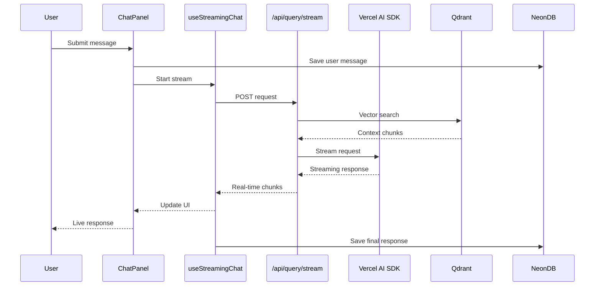
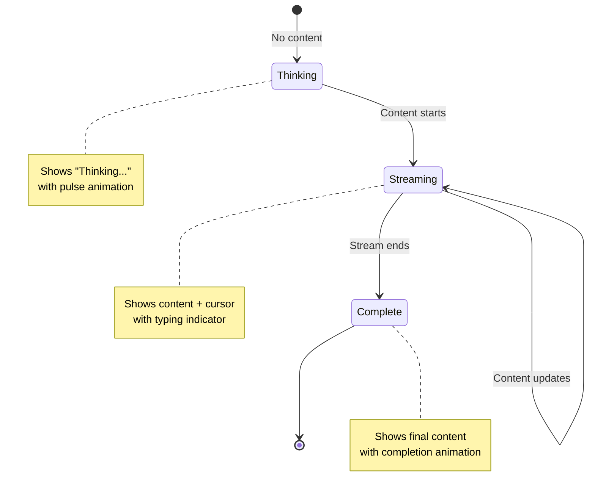
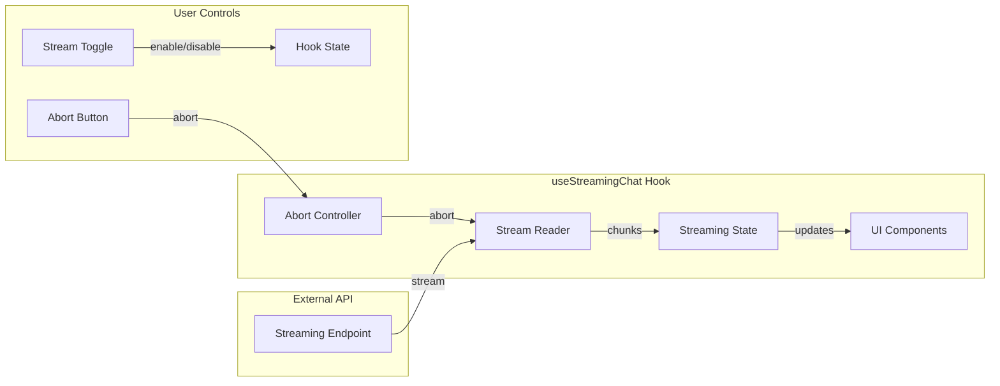
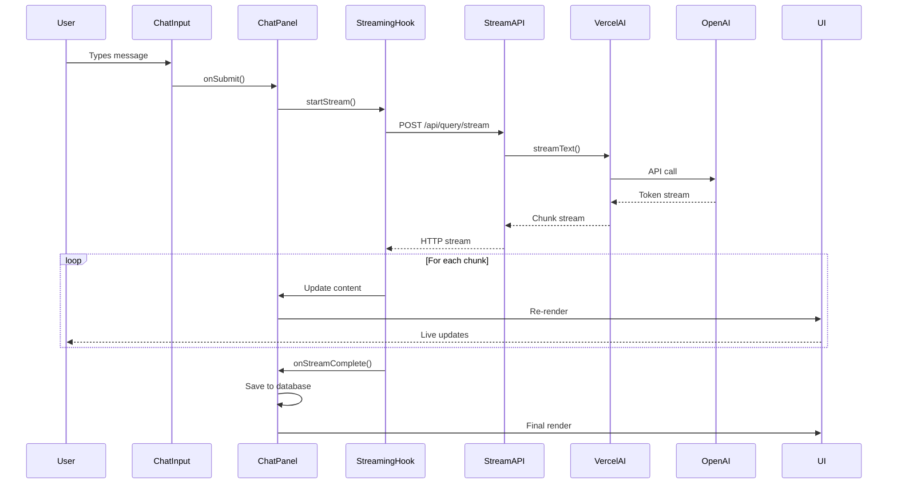
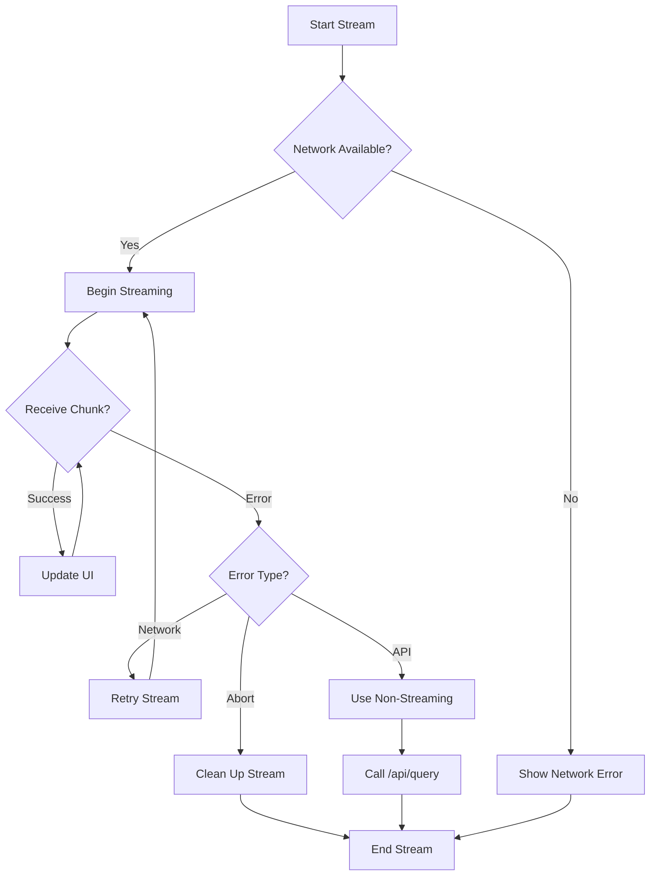

# 🚀 Vercel AI SDK Integration Documentation

## 📋 Table of Contents

1. [Overview](#overview)
2. [Architecture](#architecture)
3. [Installation & Setup](#installation--setup)
4. [Core Components](#core-components)
5. [API Endpoints](#api-endpoints)
6. [React Components](#react-components)
7. [Custom Hooks](#custom-hooks)
8. [Streaming Flow](#streaming-flow)
9. [Configuration](#configuration)
10. [Usage Examples](#usage-examples)
11. [Troubleshooting](#troubleshooting)
12. [Migration Guide](#migration-guide)

## 🎯 Overview

The Vercel AI SDK integration enhances PaperLM with real-time streaming AI responses, providing users with immediate feedback and a more interactive experience. This implementation maintains full backward compatibility while adding advanced streaming capabilities.

### Key Features

- ✅ **Real-time streaming responses**
- ✅ **Seamless RAG integration**
- ✅ **Citation extraction**
- ✅ **Stream control (pause/abort)**
- ✅ **Fallback to non-streaming**
- ✅ **Type-safe implementation**
- ✅ **Error boundaries**
- ✅ **Performance optimizations**

## 🏗️ Architecture

### System Architecture Diagram

```mermaid
graph TB
    subgraph "Frontend Components"
        UI[User Interface]
        CP[Chat Panel]
        SM[Streaming Message]
        CI[Chat Input]
    end
    
    subgraph "Custom Hooks"
        SC[useStreamingChat]
        DC[useDocuments]
    end
    
    subgraph "API Layer"
        QS[/api/query/stream]
        CS[/api/chat/stream]
        Q[/api/query]
        C[/api/chat]
    end
    
    subgraph "AI Infrastructure"
        AI[src/lib/ai.ts]
        VO[Vercel AI SDK]
        OAI[OpenAI Provider]
    end
    
    subgraph "RAG System"
        QD[Qdrant Vector DB]
        EMB[Document Embeddings]
        CTX[Context Building]
    end
    
    subgraph "Data Storage"
        ND[NeonDB]
        CONV[Conversations]
        MSG[Messages]
    end
    
    UI --> CP
    CP --> SM
    CP --> CI
    CP --> SC
    
    SC --> QS
    SC --> CS
    
    QS --> AI
    CS --> AI
    Q --> AI
    C --> ND
    
    AI --> VO
    VO --> OAI
    
    QS --> QD
    QD --> EMB
    EMB --> CTX
    
    CS --> ND
    QS --> ND
```

### Data Flow Architecture



## 📦 Installation & Setup

### Dependencies Added

```json
{
  "dependencies": {
    "ai": "^5.0.22",
    "@ai-sdk/openai": "^2.0.19"
  }
}
```

### Environment Variables

```env
# Required for Vercel AI SDK
OPENAI_API_KEY=your_openai_api_key_here
OPENAI_MODEL=gpt-4o # Optional, defaults to gpt-4o
```

### Installation Steps

```bash
# Install dependencies
npm install ai @ai-sdk/openai

# Verify installation
npm run dev
```

## 🔧 Core Components

### 1. AI Configuration (`src/lib/ai.ts`)

The central AI configuration module that sets up Vercel AI SDK providers and utilities.

```typescript
import { createOpenAI } from '@ai-sdk/openai';
import { generateText, streamText } from 'ai';

// OpenAI provider configuration
export const openai = createOpenAI({
  apiKey: process.env.OPENAI_API_KEY,
});

// Model configuration
export const AI_MODEL = process.env.OPENAI_MODEL || 'gpt-4o';
```

#### Key Functions

| Function | Purpose | Returns |
|----------|---------|---------|
| `generateAIResponse()` | Non-streaming AI generation | `Promise<string>` |
| `streamAIResponse()` | Streaming AI generation | `DataStreamResponse` |
| `generateQueryVariations()` | Enhanced context retrieval | `Promise<string[]>` |
| `enhanceResponseFormatting()` | Response post-processing | `string` |
| `createSystemPrompt()` | Dynamic prompt creation | `string` |

#### System Prompt Features

- **Document-grounded responses**: Only uses provided context
- **Professional formatting**: Markdown with structured sections
- **Citation requirements**: References with document names and chunks
- **Quality standards**: Clear, concise, well-structured output

### 2. Streaming Architecture

#### Non-Streaming Flow (Legacy)
```
User Input → /api/query → OpenAI Direct → Complete Response → UI Update
```

#### Streaming Flow (New)
```
User Input → /api/query/stream → Vercel AI SDK → Real-time Chunks → Live UI Updates
```

## 🔌 API Endpoints

### 1. `/api/query/stream` - Streaming RAG Queries

**Purpose**: Provides real-time streaming responses with document context.

#### Request Format
```typescript
POST /api/query/stream
Content-Type: application/json

{
  "message": "What are the key findings in the research?",
  "sessionId": "user_session_123",
  "userEmail": "user@example.com",
  "chatHistory": [
    {
      "role": "user",
      "content": "Previous message"
    }
  ]
}
```

#### Response Format
```typescript
// Headers
X-Citations: '[{"id":"citation-1","documentName":"research.pdf",...}]'
X-Context: 'true'
X-Search-Results: '15'
Content-Type: 'text/plain; charset=utf-8'

// Streaming body
The research findings indicate that...
[continues streaming in real-time]
```

#### Implementation Details

```typescript
export async function POST(request: NextRequest) {
  // 1. Extract request parameters
  const { message, chatHistory, sessionId, userEmail } = await request.json();
  
  // 2. Perform vector search with query variations
  const primaryResults = await similaritySearch(message, 20, storageId);
  const queryVariations = await generateQueryVariations(message, chatHistory);
  
  // 3. Build context from document chunks
  const contextChunks = selectAdjacentChunks(sortedChunks);
  const context = contextChunks.join('\n\n');
  
  // 4. Stream AI response
  const streamResponse = await streamAIResponse(messages, context);
  
  // 5. Return streaming response with citations in headers
  return new Response(streamResponse.body, { headers });
}
```

### 2. `/api/chat/stream` - Streaming Chat

**Purpose**: Handles streaming chat conversations with message persistence.

#### Features
- Conversation management
- Message persistence to NeonDB
- Usage tracking
- Authentication integration

## ⚛️ React Components

### 1. StreamingMessage Component

**Location**: `src/components/chat/StreamingMessage.tsx`

**Purpose**: Displays AI responses as they stream in real-time.

#### Props Interface
```typescript
interface StreamingMessageProps {
  content: string;           // Current streaming content
  isStreaming: boolean;      // Whether currently streaming
  onStreamComplete?: () => void; // Completion callback
}
```

#### Features
- **Real-time content updates** during streaming
- **Typing indicator** with animated cursor
- **Markdown rendering** for formatted responses
- **Smooth animations** with Framer Motion
- **Status indicators** showing streaming state

#### Visual States



#### Usage Example
```typescript
<StreamingMessage
  content={streamingContent}
  isStreaming={isStreaming}
  onStreamComplete={() => {
    console.log('Stream completed');
  }}
/>
```

### 2. Enhanced ChatInput Component

**Location**: `src/components/chat/ChatInput.tsx`

#### New Features Added

| Feature | Icon | Purpose |
|---------|------|---------|
| Streaming Toggle | ⚡ | Enable/disable real-time streaming |
| Abort Stream | 🛑 | Stop streaming mid-response |
| Status Indicator | 🔄 | Show current streaming state |

#### Updated Props
```typescript
interface ChatInputProps {
  // ... existing props
  enableStreaming?: boolean;        // Streaming mode toggle
  onToggleStreaming?: (enabled: boolean) => void;
  isStreaming?: boolean;           // Current streaming state
  onAbortStream?: () => void;      // Abort function
}
```

#### Control Layout
```
[Message Input Field] [🛑] [⚡] [📤 Send]
                      ↑    ↑    ↑
                   Abort  Toggle Send
```

### 3. Updated AIChatPanel

**Location**: `src/components/panels/AIChatPanel.tsx`

#### Streaming Integration

```typescript
// Streaming hook integration
const {
  isStreaming,
  streamingContent,
  startStream,
  abortStream,
  clearStream,
} = useStreamingChat({
  onStreamStart: () => setIsLoading(false),
  onStreamComplete: async (content: string) => {
    // Convert to regular message and save
  },
  onError: (error) => {
    // Handle streaming errors
  },
});
```

#### Message Rendering Logic

```typescript
{/* Regular messages */}
{messages.map((message) => (
  <ChatMessageComponent key={message.id} message={message} />
))}

{/* Streaming message */}
{isStreaming && (
  <StreamingMessage
    content={streamingContent}
    isStreaming={isStreaming}
  />
)}

{/* Loading indicator (only when not streaming) */}
{isLoading && !isStreaming && (
  <LoadingIndicator />
)}
```

## 🎣 Custom Hooks

### useStreamingChat Hook

**Location**: `src/hooks/useStreamingChat.ts`

**Purpose**: Manages streaming chat state and provides control functions.

#### Hook Interface
```typescript
interface StreamingChatOptions {
  onStreamStart?: () => void;
  onStreamComplete?: (content: string) => void;
  onError?: (error: Error) => void;
}

interface StreamingChatReturn {
  // State
  isStreaming: boolean;
  streamingContent: string;
  error: string | null;
  
  // Actions
  startStream: (endpoint: string, body: any) => Promise<any>;
  abortStream: () => void;
  clearStream: () => void;
}
```

#### Internal Architecture



#### Stream Management
```typescript
const startStream = async (endpoint: string, requestBody: Record<string, unknown>) => {
  // 1. Abort existing streams
  if (abortControllerRef.current) {
    abortControllerRef.current.abort();
  }
  
  // 2. Setup new stream
  abortControllerRef.current = new AbortController();
  
  // 3. Fetch with streaming
  const response = await fetch(endpoint, {
    method: 'POST',
    body: JSON.stringify(requestBody),
    signal: abortControllerRef.current.signal,
  });
  
  // 4. Process stream chunks
  const reader = response.body.getReader();
  const decoder = new TextDecoder();
  
  while (true) {
    const { done, value } = await reader.read();
    if (done) break;
    
    const chunk = decoder.decode(value, { stream: true });
    // Update state with new content
  }
};
```

## 🌊 Streaming Flow

### Complete Streaming Sequence



### Error Handling Flow



## ⚙️ Configuration

### Environment Setup

```env
# Required
OPENAI_API_KEY=sk-...

# Optional - Model Configuration
OPENAI_MODEL=gpt-4o              # Default model
OPENAI_MAX_TOKENS=2000           # Max response tokens
OPENAI_TEMPERATURE=0.3           # Response creativity

# Optional - Streaming Configuration
ENABLE_STREAMING=true            # Global streaming toggle
STREAM_TIMEOUT=30000             # Stream timeout (ms)
MAX_CONTEXT_CHARS=12000          # Context window size
```

### Runtime Configuration

```typescript
// In src/lib/ai.ts
export const AI_CONFIG = {
  model: process.env.OPENAI_MODEL || 'gpt-4o',
  temperature: 0.3,
  maxTokens: 2000,
  timeout: 30000,
};

// In components
const [enableStreaming, setEnableStreaming] = useState(
  process.env.ENABLE_STREAMING !== 'false'
);
```

### Feature Flags

```typescript
// Feature toggle system
const FEATURES = {
  streaming: process.env.ENABLE_STREAMING !== 'false',
  abortControls: process.env.ENABLE_ABORT_CONTROLS !== 'false',
  streamingToggle: process.env.ENABLE_STREAMING_TOGGLE !== 'false',
};
```

## 💡 Usage Examples

### Basic Streaming Chat

```typescript
import { useStreamingChat } from '@/hooks/useStreamingChat';

function ChatComponent() {
  const { 
    isStreaming, 
    streamingContent, 
    startStream 
  } = useStreamingChat({
    onStreamStart: () => console.log('Stream started'),
    onStreamComplete: (content) => console.log('Complete:', content),
    onError: (error) => console.error('Error:', error),
  });

  const handleSendMessage = async (message: string) => {
    await startStream('/api/query/stream', {
      message,
      sessionId: 'session-123',
    });
  };

  return (
    <div>
      {isStreaming && (
        <StreamingMessage 
          content={streamingContent}
          isStreaming={isStreaming}
        />
      )}
      <ChatInput onSubmit={handleSendMessage} />
    </div>
  );
}
```

### Custom Stream Configuration

```typescript
const customStreamConfig = {
  endpoint: '/api/custom-stream',
  options: {
    temperature: 0.7,
    maxTokens: 1500,
  },
  retries: 3,
  timeout: 60000,
};

const { startStream } = useStreamingChat({
  onStreamStart: () => setIsLoading(false),
  onStreamComplete: async (content) => {
    // Custom processing
    const processedContent = await processResponse(content);
    saveToDatabase(processedContent);
  },
});
```

### Error Boundaries

```typescript
import { ErrorBoundary } from 'react-error-boundary';

function StreamingErrorFallback({ error, resetErrorBoundary }) {
  return (
    <div className="error-container">
      <h2>Streaming Error</h2>
      <p>{error.message}</p>
      <button onClick={resetErrorBoundary}>
        Try Again
      </button>
    </div>
  );
}

function App() {
  return (
    <ErrorBoundary 
      FallbackComponent={StreamingErrorFallback}
      onError={(error) => console.error('Streaming error:', error)}
    >
      <ChatPanel />
    </ErrorBoundary>
  );
}
```

## 🔧 Troubleshooting

### Common Issues

#### 1. Streaming Not Working

**Symptoms:**
- No real-time updates
- "Stream failed" errors
- Fallback to non-streaming mode

**Solutions:**
```typescript
// Check environment variables
console.log('OpenAI Key:', process.env.OPENAI_API_KEY?.slice(0, 10));
console.log('Model:', process.env.OPENAI_MODEL);

// Verify API endpoint
const response = await fetch('/api/query/stream', {
  method: 'POST',
  headers: { 'Content-Type': 'application/json' },
  body: JSON.stringify({ message: 'test' }),
});
console.log('Status:', response.status);
console.log('Headers:', response.headers);
```

#### 2. Citations Not Appearing

**Symptoms:**
- Responses stream but no citations
- `X-Citations` header missing

**Solutions:**
```typescript
// Debug citation extraction
const citationsHeader = response.headers.get('X-Citations');
console.log('Citations header:', citationsHeader);

// Verify RAG pipeline
const searchResults = await similaritySearch(message, 20, storageId);
console.log('Search results:', searchResults.length);
```

#### 3. Performance Issues

**Symptoms:**
- Slow streaming
- UI freezing during updates
- Memory leaks

**Solutions:**
```typescript
// Optimize update frequency
const CHUNK_THROTTLE = 100; // ms
const throttledUpdate = useCallback(
  throttle((content) => setStreamingContent(content), CHUNK_THROTTLE),
  []
);

// Memory cleanup
useEffect(() => {
  return () => {
    abortStream();
    clearStream();
  };
}, []);
```

### Debug Tools

#### Stream Monitor
```typescript
function StreamMonitor({ isStreaming, content }) {
  return process.env.NODE_ENV === 'development' ? (
    <div className="debug-panel">
      <p>Streaming: {isStreaming ? '🟢' : '🔴'}</p>
      <p>Content Length: {content.length}</p>
      <p>Chunks Received: {content.split('').length}</p>
    </div>
  ) : null;
}
```

#### API Response Logger
```typescript
// In /api/query/stream/route.ts
if (process.env.NODE_ENV === 'development') {
  console.log('Request:', { message, sessionId });
  console.log('Search results:', results.length);
  console.log('Context chars:', context.length);
}
```

## 📈 Migration Guide

### From Direct OpenAI to Vercel AI SDK

#### Before (Direct OpenAI)
```typescript
const response = await openai.chat.completions.create({
  model: 'gpt-4',
  messages: [...messages],
  temperature: 0.3,
});
return response.choices[0].message.content;
```

#### After (Vercel AI SDK)
```typescript
const result = await generateText({
  model: openai('gpt-4o'),
  messages: [...messages],
  temperature: 0.3,
});
return result.text;
```

### Migration Checklist

- [ ] Install Vercel AI SDK dependencies
- [ ] Update environment variables
- [ ] Replace direct OpenAI calls
- [ ] Add streaming endpoints
- [ ] Update React components
- [ ] Test streaming functionality
- [ ] Update error handling
- [ ] Performance optimization

### Backward Compatibility

The integration maintains full backward compatibility:

```typescript
// Legacy mode (automatically used if streaming fails)
const legacyResponse = await fetch('/api/query', {
  method: 'POST',
  body: JSON.stringify(requestBody),
});

// New streaming mode
const streamResponse = await fetch('/api/query/stream', {
  method: 'POST',
  body: JSON.stringify(requestBody),
});
```

## 📚 Additional Resources

### Related Documentation
- [Vercel AI SDK Documentation](https://sdk.vercel.ai/docs)
- [OpenAI API Reference](https://platform.openai.com/docs/api-reference)
- [React Streaming Patterns](https://react.dev/reference/react-dom/server)

### Performance Best Practices
- Use throttling for high-frequency updates
- Implement proper cleanup in useEffect
- Monitor memory usage during long streams
- Optimize re-rendering with React.memo

### Security Considerations
- Validate all streaming inputs
- Implement rate limiting
- Secure API endpoints
- Handle sensitive data properly

---

**Last Updated**: August 2025  
**Version**: 1.0.0  
**Compatibility**: Next.js 15+, React 19+, TypeScript 5+