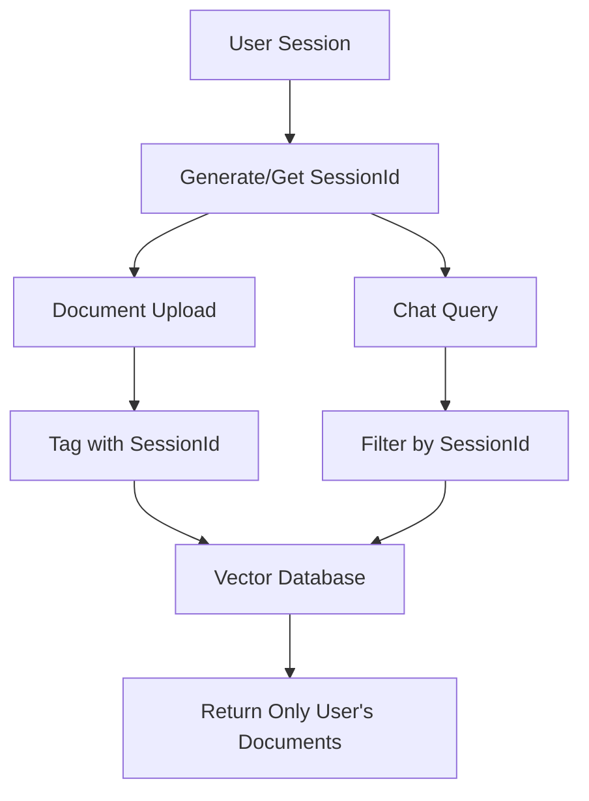

# Session-Based Context Isolation Documentation

## Overview

This document describes the implementation of session-based context isolation in PaperLM, ensuring that each user only has access to their own uploaded documents and cannot view or interact with content from other users.

## Table of Contents

1. [Architecture Overview](#architecture-overview)
2. [Implementation Details](#implementation-details)
3. [API Changes](#api-changes)
4. [Frontend Changes](#frontend-changes)
5. [Database Schema](#database-schema)
6. [Security Model](#security-model)
7. [Usage Examples](#usage-examples)
8. [Testing Guide](#testing-guide)
9. [Troubleshooting](#troubleshooting)

## Architecture Overview

The session isolation system works by tagging every document and chunk with a unique `sessionId` and filtering all operations based on this identifier.



### Key Components

- **Session Management**: Handled by `src/lib/sessionStorage.ts`
- **Vector Database**: Enhanced Qdrant integration with session filtering
- **API Layer**: All APIs now require and validate sessionId
- **Frontend**: Components automatically include sessionId in requests

## Implementation Details

### Session ID Generation

```typescript
// src/lib/sessionStorage.ts
export function generateSessionId(): string {
  return `session_${Date.now()}_${Math.random().toString(36).substr(2, 9)}`;
}
```

Sessions are:
- Generated on first app visit
- Stored in localStorage
- Valid for 48 hours
- Automatically renewed on activity

### Document Metadata Schema

Every document chunk now includes session information:

```typescript
export type RAGMetadata = {
  documentId: string;
  chunkId: string;
  chunkIndex: number;
  startChar: number;
  endChar: number;
  fileName: string;
  fileType: string;
  fileSize: number;
  sessionId: string; // 🆕 Session isolation field
  sourceUrl?: string;
  loader?: string;
  uploadedAt?: string;
};
```

### Vector Search Filtering

The similarity search now filters results by sessionId:

```typescript
// src/lib/qdrant.ts
export async function similaritySearch(
  query: string,
  k = 8,
  sessionId?: string, // 🆕 Session filter parameter
): Promise<RAGResult[]> {
  // ... search implementation with filtering
  if (sessionId) {
    searchParams.filter = {
      must: [
        {
          key: 'sessionId',
          match: { value: sessionId }
        }
      ]
    };
  }
}
```

## API Changes

### Upload API (`/api/upload`)

**Before:**
```typescript
const formData = new FormData();
formData.append('file', file);
```

**After:**
```typescript
const formData = new FormData();
formData.append('file', file);
formData.append('sessionId', getSessionId()); // 🆕 Required
```

**Response:** Now includes session validation and documents are tagged with sessionId.

### Query API (`/api/query`)

**Before:**
```typescript
{
  "message": "What is this document about?",
  "chatHistory": [...]
}
```

**After:**
```typescript
{
  "message": "What is this document about?",
  "sessionId": "session_1234567890_abc123def", // 🆕 Required
  "chatHistory": [...]
}
```

### Scrape API (`/api/scrape`)

**Before:**
```typescript
{
  "url": "https://example.com",
  "type": "website"
}
```

**After:**
```typescript
{
  "url": "https://example.com",
  "type": "website",
  "sessionId": "session_1234567890_abc123def" // 🆕 Required
}
```

## Frontend Changes

### DocumentSourcesPanel Component

```typescript
// File Upload
const formData = new FormData();
formData.append('file', file);
formData.append('sessionId', getSessionId()); // 🆕 Auto-added

// Text Input
const formData = new FormData();
formData.append('file', file);
formData.append('sessionId', getSessionId()); // 🆕 Auto-added

// Website Scraping
body: JSON.stringify({ 
  url, 
  type, 
  sessionId: getSessionId() // 🆕 Auto-added
})
```

### AIChatPanel Component

```typescript
// Chat Queries
body: JSON.stringify({
  message: currentInput,
  sessionId: getSessionId(), // 🆕 Auto-added
  chatHistory: messages.slice(-5).map((m) => ({
    role: m.role,
    content: m.content,
  })),
})
```

## Database Schema

### Qdrant Vector Database

Documents are stored with flattened payload structure:

```json
{
  "id": "uuid-v4-string",
  "vector": [0.1, 0.2, ...], // 1536-dimensional embedding
  "payload": {
    "content": "Document content...",
    "documentId": "doc-1234567890-abc123",
    "chunkId": "chunk-1234567890-def456",
    "chunkIndex": 0,
    "startChar": 0,
    "endChar": 1000,
    "fileName": "example.pdf",
    "fileType": "application/pdf",
    "fileSize": 50000,
    "sessionId": "session_1234567890_abc123def", // 🆕 Session isolation
    "sourceUrl": "https://example.com",
    "loader": "pdf",
    "uploadedAt": "2024-01-01T00:00:00.000Z"
  }
}
```

### Memory Fallback

The in-memory fallback also supports session filtering:

```typescript
// Filter by sessionId if provided
const filteredStore = sessionId 
  ? memoryStore.filter((item) => item.metadata.sessionId === sessionId)
  : memoryStore;
```

## Security Model

### Session Isolation Guarantees

1. **Document Upload Isolation**
   - ✅ Each upload is tagged with the uploader's sessionId
   - ✅ Cannot upload documents to another user's session
   - ✅ Session validation prevents unauthorized uploads

2. **Search Result Isolation**
   - ✅ Vector searches only return documents from the current session
   - ✅ Both Qdrant and memory fallback enforce filtering
   - ✅ No cross-session document leakage

3. **Chat Context Isolation**
   - ✅ AI responses only reference user's own documents
   - ✅ Citations only come from session-specific documents
   - ✅ No access to other users' conversations

4. **API Security**
   - ✅ All document APIs require valid sessionId
   - ✅ Session validation on all endpoints
   - ✅ Automatic session expiration (48 hours)

### Session Lifecycle

```
User Visit → Generate/Load SessionId → Store in localStorage → Use in API calls → Auto-renewal → Expiration (48h)
```

- **Creation**: Generated on first app visit
- **Storage**: Stored in browser localStorage
- **Validation**: Checked on every API request
- **Renewal**: Extended on activity
- **Expiration**: Automatic cleanup after 48 hours

## Usage Examples

### Example 1: Document Upload Flow

```typescript
// 1. User uploads a document
const sessionId = getSessionId(); // "session_1674123456_abc123def"

// 2. Document gets processed and stored
await addDocuments([{
  pageContent: "Document content...",
  metadata: {
    documentId: "doc-1674123456-xyz789",
    chunkId: "chunk-1674123456-123",
    // ... other metadata
    sessionId: "session_1674123456_abc123def" // 🔒 Session tagged
  }
}]);

// 3. Only this user can search this document
const results = await similaritySearch("query", 10, sessionId);
// Returns only documents with matching sessionId
```

### Example 2: Multi-User Scenario

```typescript
// User A uploads document
SessionA = "session_1674123456_userA"
Document A tagged with SessionA

// User B uploads document  
SessionB = "session_1674123456_userB"
Document B tagged with SessionB

// User A queries
similaritySearch("query", 10, SessionA) 
// → Returns only Document A

// User B queries
similaritySearch("query", 10, SessionB) 
// → Returns only Document B
```

## Testing Guide

### Unit Tests

Test session isolation at the API level:

```typescript
describe('Session Isolation', () => {
  test('documents are tagged with sessionId', async () => {
    const sessionId = generateSessionId();
    const docs = await uploadDocument(file, sessionId);
    expect(docs[0].metadata.sessionId).toBe(sessionId);
  });

  test('search filters by sessionId', async () => {
    const sessionA = generateSessionId();
    const sessionB = generateSessionId();
    
    await uploadDocument(fileA, sessionA);
    await uploadDocument(fileB, sessionB);
    
    const resultsA = await similaritySearch("test", 10, sessionA);
    const resultsB = await similaritySearch("test", 10, sessionB);
    
    expect(resultsA.every(r => r.metadata.sessionId === sessionA)).toBe(true);
    expect(resultsB.every(r => r.metadata.sessionId === sessionB)).toBe(true);
  });
});
```

### Integration Tests

Test the full flow with multiple users:

1. **Setup**: Create two browser sessions
2. **Upload**: Each session uploads different documents
3. **Query**: Verify each session only sees own documents
4. **Cross-Check**: Confirm no cross-session access

### Manual Testing

1. Open app in two different browser windows/incognito sessions
2. Upload different documents in each session
3. Ask questions in both sessions
4. Verify responses only reference own documents
5. Check browser dev tools for sessionId in requests

## Troubleshooting

### Common Issues

#### 1. "No session ID provided" Error

**Cause**: Frontend not sending sessionId in requests
**Solution**: 
```typescript
// Ensure getSessionId() is called and included
import { getSessionId } from '@/lib/sessionStorage';
// Include in request body or FormData
```

#### 2. Empty Search Results

**Cause**: sessionId mismatch between upload and search
**Solution**:
```typescript
// Check sessionId consistency
const uploadSessionId = getSessionId(); // During upload
const searchSessionId = getSessionId(); // During search
console.log('Session IDs match:', uploadSessionId === searchSessionId);
```

#### 3. Cross-Session Document Access

**Cause**: Session filtering not applied
**Solution**:
```typescript
// Verify sessionId is passed to search
await similaritySearch(query, limit, sessionId); // ✅ Correct
await similaritySearch(query, limit); // ❌ No filtering
```

### Debugging Tools

#### Check Session Information

```typescript
// Get current session data
const sessionData = getSessionData();
console.log('Session ID:', sessionData?.sessionId);
console.log('Documents:', sessionData?.documents.length);

// Verify document sessionIds
sessionData?.documents.forEach(doc => {
  console.log(`Document ${doc.id}: sessionId = ${doc.sessionId || 'missing'}`);
});
```

#### Monitor API Requests

```typescript
// Add logging to track sessionId in requests
console.log('Upload request sessionId:', formData.get('sessionId'));
console.log('Query request sessionId:', requestBody.sessionId);
```

### Performance Considerations

1. **Vector Database**: Session filtering adds minimal overhead to queries
2. **Memory Usage**: Each session maintains separate document lists
3. **Session Cleanup**: Expired sessions should be cleaned up periodically

### Migration Notes

For existing installations:
1. Existing documents without sessionId will have `sessionId: 'unknown'`
2. These documents won't appear in filtered searches
3. Users may need to re-upload documents for proper isolation
4. Consider running a migration script to assign sessionIds to existing data

## Conclusion

The session-based context isolation system provides robust privacy and security for multi-user PaperLM deployments. Each user's documents are completely isolated from others, ensuring private and secure document analysis workflows.

For questions or issues, refer to the troubleshooting section or check the implementation files mentioned in this documentation.